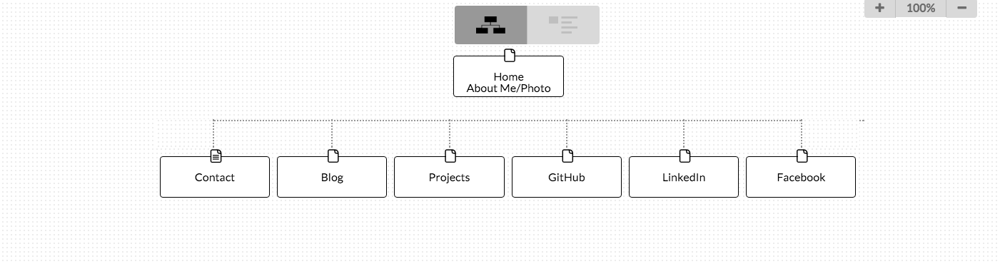

####What are the 6 Phases of Web Design?
1. Gathering Information
2. Planning
3. Design
4. Development
5. Testing and Delivery
6. Maintenance

####What is your site's primary goal or purpose? What kind of content will your site feature?
My site's main purpose is to provide information about myself in a fun but professional way. The content will be personal information about myself such as social media links, a short 'about me', projects, etc.

####What is the primary "action" the user should take when coming to your site? Do you want them to search for information, contact you, or see your portfolio? It's ok to have several actions at once, or different actions for different kinds of visitors.
The primary action should be to gather information about me and see my portfolio. I'm hoping that a lot of visitors to my site will be potential employers looking to get a better idea of who I am as person and developer. Users will be able to contact me throught the website but I think the main action will be to find out more about me other than what was gathered through a job application or interview. A user who isn't a potential employer would be more likely to use my website as a means of contacting me.

####What are the main things someone should know about design and user experience?
There is a lot of planning and information gathering that needs to be done before starting on the design. It's important to really consider who is the target audience and what are they going to be using the site for. You need to think about how these users might walk through the website and use that information as you start to design your site. I think the main thing to know about user experience is that it goes beyond just the usability of a website; it is about how the user feels when using the website. User experience involves a more human aspect of design rather than just focusing on maximizing efficiency.

####What is user experience design and why is it valuable?
User experience design focuses on designing applications, website, etc. with the user in mind. Instead of just designing to maximize efficiency, user experience design focuses on how the user is feeling, how simple it is to use, and their perceived value of the product. It's valuable because websites are becoming increasingly advanced with more and more features. If a user doesn't enjoy navigating through the site to use all these great features they aren't going to come back. A good example in a world where so much shopping is done online is the virtual shopping cart. If it's not simple and fun for the user to drop an item in the cart, they'll quickly find another site where they can get a similar product more easily.

####Which parts of the challenge did you find tedious?
Just drawing out my site map and thinkng about the placement of different pages was the most tedious part for me. I just want to make sure that the flow of my website is natural. My style is very minimalist so I want to balance a clean website while still including all pertinent information.