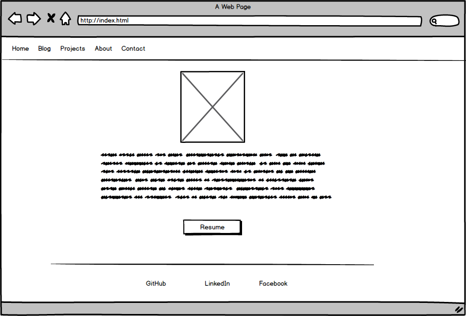
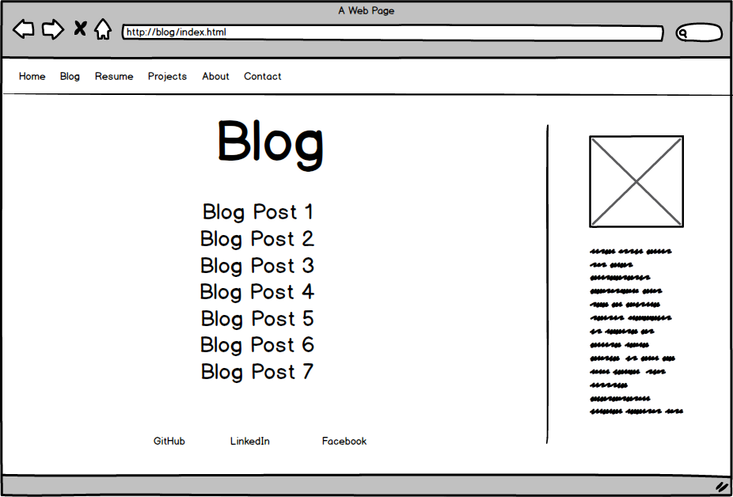

####What is a wireframe?
A wireframe is like the outline of your website created during the planning or design stage. You can create a wireframe by hand or use a program, there are many choices out there. It's essentially a rough draft of the website outlining the main parts (header, body, footer, nnavbar, etc.). It is typically just greyscale although color can be added.

####What are the benefits of wireframing?
Some of the benefits are determining usability, allowing yourself to make changes to the design easily before the development has started, getting feedback quickly, and ability to focus on the flow of the website. Because the wireframe doesn't go into detail with content or style you can focus on the flow of the webpage and the overall aesthetic.

####Did you enjoy wireframing your site?
I did, it was a great creative outlet.

####Did you revise your wireframe or stick with your first idea?
I did end up revising my wireframe. I just didn't like the direction I was going at first so I took a break and came back to it and ended up making a different layout than before.

####What questions did you ask during this challenge? What resources did you find to help you answer them?
I just had general questions as far as what a good wireframe looks like. I added the Wirify bookmarklet and took a look at some different websites to get a feel for the different ways a wireframe could be done. Another question I had was which wireframe tool to use. I read through a list of the top 20 according to one source (http://www.creativebloq.com/wireframes/top-wireframing-tools-11121302) and compared that to the list in our required reading; I ended up using Balsamiq.

####Which parts of the challenge did you enjoy and which parts did you find tedious?
The part I enjoyed the most was actually creating the wireframe. I used Balsamiq beause it seemed like a popular choice and I did end up liking it a lot. It was very user friendly even for someone who had never done this before. The most tedious thing for me was deciding on the layout. At first I started thinking too much about the color and font and had to re-focus myself to just thinking about the wireframe. Once I did this I was able to come up with a layout I was happy with.

