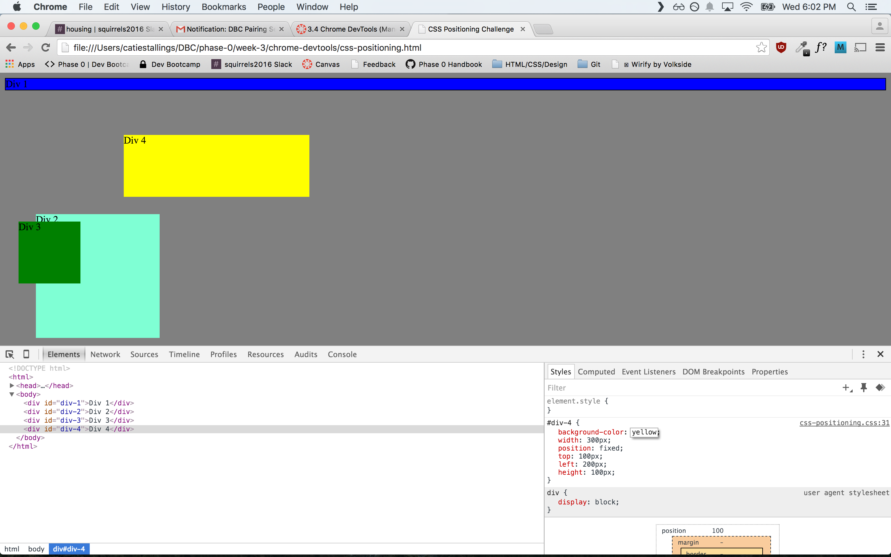

####How can you use Chrome's DevTools inspector to help you format or position elements?
It allows you to visibly see the margins, padding, border, etc. so you can better decide which to change in order to position your elements correctly.

####How can you resize elements on the DOM using CSS?
Using Chrome Devtools you can live-edit the CSS to resize the elements. To resize an element you would typically change width, height, position, display, or a combination. You can use pixels, percentage, or ems as a unit of measure but it's typically better to use ems or persentages to allow for more fluidity in the website.

####What are the differences between absolute, fixed, static, and relative positioning? Which did you find easiest to use? Which was most difficult?
 A fixed element always stays in the same place even when the page is scrolled, it's positioned relative to the viewport.
Absolute positioning is relative to the nearest positioned object. Any formatting is applied relative to that ancestor rather than the viewport.
Static is the default positioning; it is positioned according to the flow of the page.
Relative positioning is relative to the object's normal position on a page as opposed to an ancestor or the viewport.

Fixed is the easiest for me to use because I always know where the position will be regardless of other elements on the page. It seems a little more predictable than the other types of positioning. Relative is the most confusing because it's not positioned to the viewport or another object, it gets a little tricky for me when I start adding margins and padding to relative objects.

####What are the differences between margin, border, and padding?
Padding is the element's area between the content and the border. The border is the area between the padding and the margin. Changing padding affects the contents of the element whereas the margin affects the space outside of the contents area.

####What was your impression of this challenge overall? (love, hate, and why?)
I loved this challenge because I really needed some practice with positioning and Chrome Devtools is a great way to visualize the padding, margin, and border. I learn best by seeing and doing and this challenge combined that for me.

