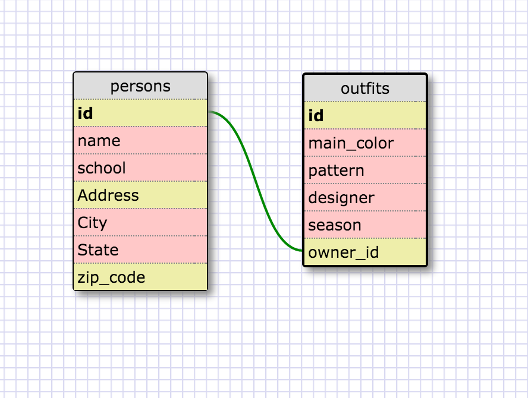

####Release 5:
1.  SELECT * FROM states;
2.  SELECT * FROM regions;
3.  SELECT state_name, population FROM states;
4.  SELECT state_name, population FROM states
    ORDER BY population DESC;
5.  SELECT state_name FROM states
    WHERE region_id = 7;
6.  SELECT state_name, population_density FROM states
    WHERE population_density > 50
    ORDER BY population_density ASC;
7.  SELECT state_name FROM states
    WHERE population BETWEEN 1000000 AND 1500000;
8.  SELECT state_name, region_id FROM states
    ORDER BY region_id ASC;
9.  SELECT region_name FROM regions
    WHERE region_name LIKE '%Central%';
10. SELECT regions.region_name, states.state_name
    FROM regions
    JOIN states
    ON regions.id = states.region_id
    ORDER BY states.region_id ASC;

####Release 6:

####Reflection:
1. What are databases for?
  Databases are for storing data in an organized way that allows it to be searched through, filtered, edited, etc.
2. What is a one-to-many relationship?
  A relationship between two entities where one entity HAS MANY of the other entity or one entity BELONGS TO another entity.
3. What is a primary key? What is a foreign key? How can you determine which is which?
  A primary key is a unique identifier of a record in a table, every record must have a primary key. A foreign key is a field in one table that points to the primary key in a differnt table; they do not have ot be unique. The easiest way for me to determine which is which is by asking myself if there could be duplicate values. If the answer is 'no' - you are talking about a primary key.
4. How can you select information out of a SQL database? What are some general guidelines for that?
  You would type:
  SELECT column_1, column_2 (or * for all columns)
  FROM table_name;
  It's best practice to use all caps for keywords such as 'SELECT', 'FROM', 'WHERE' etc. and you must end the statement with a semi-colon.
  You should sepeterate the column names you are selecting with commas. You can also select data that meets certain criteria using this syntax:
  SELECT column_name
  FROM table_name
  WHERE column_name operator value;

