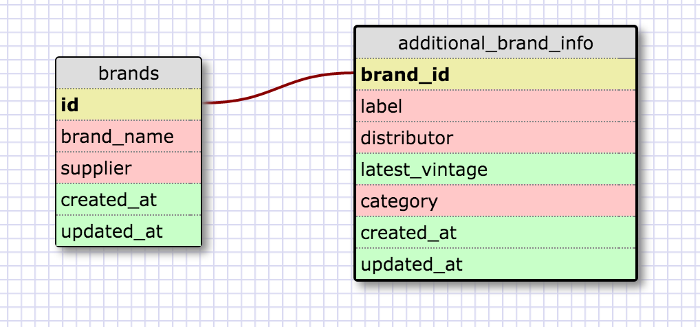

####Challeng 8.5 Release 2:

I used to work in the wine industry so I used the example of wine brands and labels as a one-to-one relationship. There are many wine brands out there and each one must have one name, supplier, and distributor so those fields belonged in the brands table. I created a separate table for labels because not every wine has a label but if they do have a label, it's only one, they can't have multiple labels.

####Challenge 5 Release 4:

####Reflection:
1. What is a one-to-one database?
  A database in which the fields in one table have a pair in another table. An example is each state in the US has one capital city, this is a one-to-one relationship.
2. When would you use a one-to-one database? (Think generally, not in terms of the example you created).
  A good time to use this type of database is when you have a relationship between two fields but not every entry has this relationship and the value would be NULL. Instead of having many empty entries in your table, you could create another table just for that field.
3. What is a many-to-many database?
  A database where you have relationships between multiple entries in one table to multiple entries in another table. An example would be teachers and courses. Teachers teach multiple courses and courses can be taught by different teachers. You would use a join table to link the teacher id and course id.
4. When would you use a many-to-many database? (Think generally, not in terms of the example you created).
  When you have multiple entries in a table that relate to many entries of another table, you would use a many-to-many database.
5. What is confusing about database schemas? What makes sense?
  I don't find it that confusing at this point, but I know that when talking about large databases these general concepts will be harder to understand. It just takes me a little time to really think through the relationship to determine what it is. The many-to-many and one-to-many relationships make the most sense to me because I can think of more instances where it would be necessary.